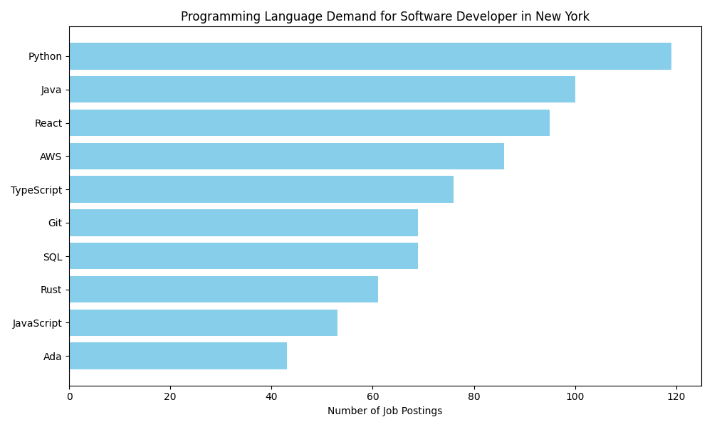

# market-tech-stack-analysis
Market tech stack analysis





This repository contains a Jupyter notebook that collects data on the demand for various programming languages in job postings for a specified job title and location using web scraping techniques. The collected data is then analyzed and visualized to provide insights into the most sought-after programming languages in the job market for the given criteria.

You can modify the job title and location variables in the notebook to analyze different roles and regions. 

You can add more programming languages or skills to the `skills.csv` file to expand the analysis further.


## Usage

> no keys is needed to run this script as it scrapes publicly available job postings.

1. Clone the repository to your local machine.

2. Install the required Python packages using pip:

```bash
python3 -m venv venv
source venv/bin/activate  # On Windows use `venv\Scripts\activate`
pip install -r requirements.txt
```

3. Open the `collect.ipynb` Jupyter notebook in your preferred environment (e.g., Jupyter Notebook, JupyterLab, VSCode).
were you can explore the data that has been collected.